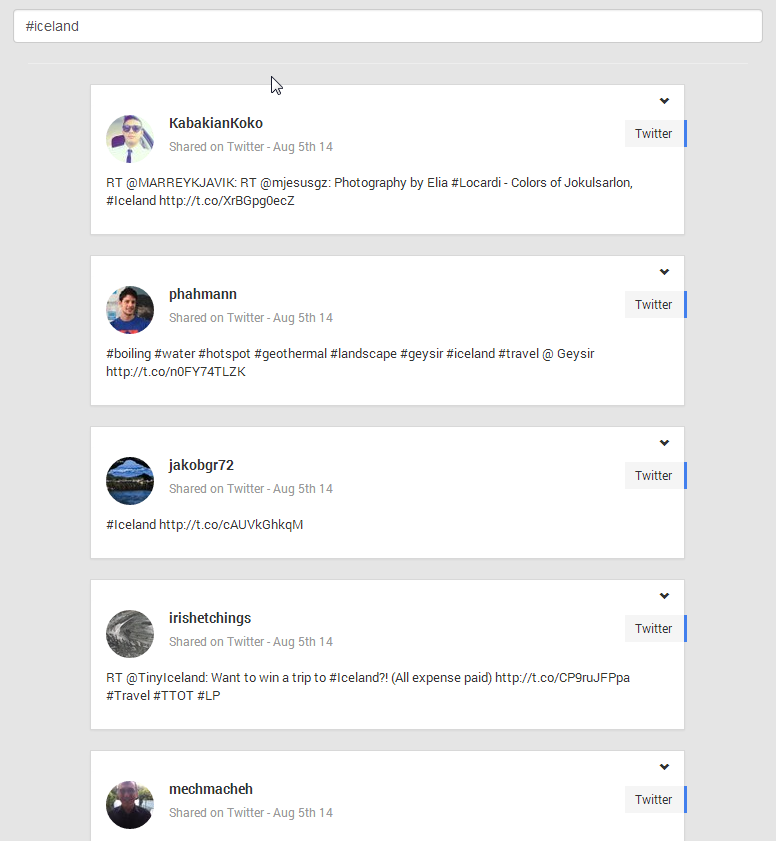

# Partify
Partify is an dashboard for looking at feeds from Instagram and Twitter in real-time. 
It is specially made for occasions like weddings, and annual celebrations where guests can tag their posts to share 
tweets or picture about the occasion :-)



*tags: Python, Flask, SocketIO, Redis, Bootstrap, Gulp*

# Installation

For this to work you will need:
* NodeJS
    * NPM for Node
* Python 2.X
    * easy_tools
* Redis server

## Dependencies installation

Install Bower globally:
```
$> npm install bower -g
```

Install all other dependencies (run from project root)
```
$> npm install
```

Install all bower components
```
$> bower install
```

Install all python modules
```
$> pip install -r requirements.txt
```

Build vendors (Bootstrap, jQuery, FontAwesome, IonIcons, MomentJS, MustacheJS)
```
$> gulp default
```

# Authentication
Both Twitter and Instagram uses OAuth authentication methods. This chapter goes briefly into how to obtain tokens used for getting communications working.

## Instagram
To obtain the access token for Instagram, you will need to login to your account on http://instagram.com/developer/.
There you can manage your clients (add,edit,delete).
In this section do the following:
* Create a client with website URL and redirect URL as "http://localhost"
* Uncheck "Disable implicit OAuth" checkbox.

To get the token, do the following:
* Go to https://instagram.com/oauth/authorize/?client_id=[CLIENT_ID_HERE]&redirect_uri=http://localhost&response_type=token, where [CLIENT_ID_HERE] is your client ID from above step.
* You will be redirected to http://localhost/#access_token=[TOKEN], which will of course fail. 
* Copy the [TOKEN] string from the URL and save it in config.py.

## Twitter
To obtain the tokens for Twitter you have to start by login into Apps Management (https://apps.twitter.com/) with your Twitter user credentials.

When logged in, do the following to create a app access:
* Create a new application by clicking "Create New App".
* Fill in a name and a description that you find suitable.
* Input some valid URL.
* Skip the callback URI.
* Press "Create your Twitter Application"

Now you have created the application, now you only need to generate a access token:
* Find the tab "API Keys"
    * Copy the API Key and API secret and paste to your config.py file.
* Generate the Access Token by pressing "Create my access token"
    * Copy the Access Tokens and paste to your config.py file

You are all set.


# Configuration 

The configuration file is located in the the main module "partify" and is named *config.py*.

# Running the application
You can run the project with the development server provided with Flask
```
$> python run.py
```